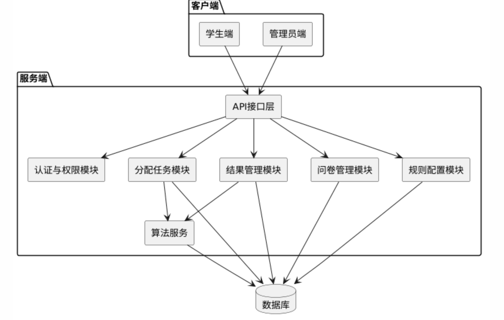
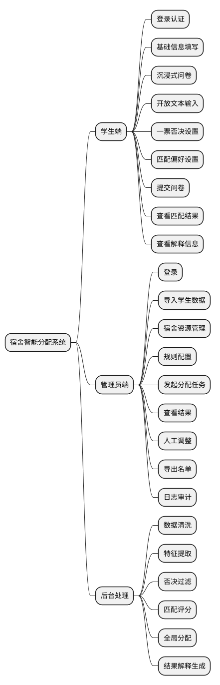
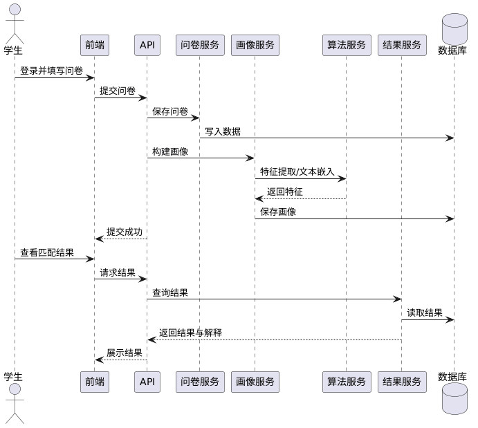
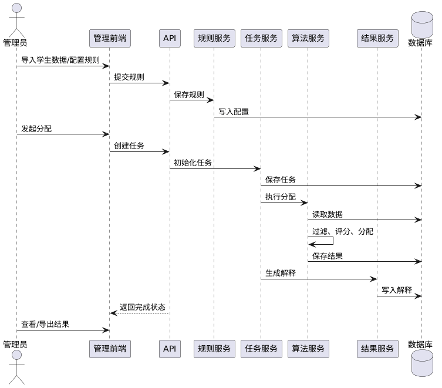
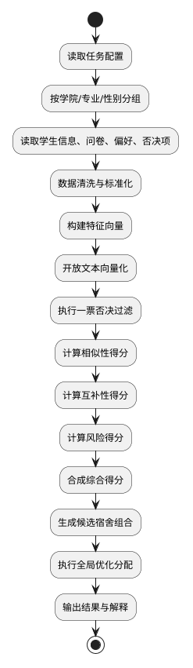
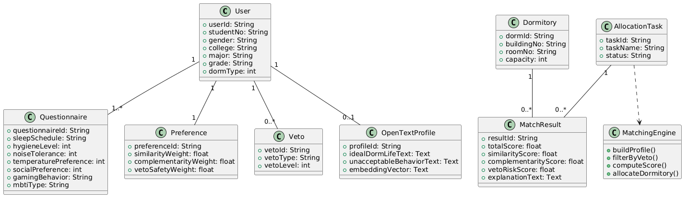

# 系统设计说明书

## 1. 系统体系架构

本系统采用前后端分离与分层设计，主要分为以下几层：

1. 表现层  
   包括学生端和管理员端 Web 前端，负责信息填写、结果展示、规则配置和管理操作。

2. 接口层  
   提供统一 API，负责参数校验、身份认证、权限控制和请求分发。

3. 业务层  
   实现学生信息管理、问卷管理、画像管理、规则配置、分配任务管理、结果管理等核心业务。

4. 算法层  
   实现数据清洗、特征提取、一票否决过滤、匹配评分、宿舍分配优化和结果解释生成。

5. 数据层  
   负责用户信息、问卷、偏好、否决项、分配任务和分配结果等数据存储。

### 1.1 系统架构图



---

## 2. 系统功能结构

### 2.1 学生端功能
1. 登录与身份认证  
2. 基础信息填写  
3. 沉浸式问卷填写  
4. 开放文本输入  
5. 一票否决项设置  
6. 匹配偏好设置  
7. 提交问卷  
8. 查看匹配结果  
9. 查看结果解释  

### 2.2 管理员端功能
1. 登录  
2. 导入学生数据  
3. 宿舍资源管理  
4. 分配规则配置  
5. 创建并执行分配任务  
6. 查看分配结果  
7. 人工调整  
8. 导出结果  
9. 日志审计  

### 2.3 功能结构图



---

## 3. 系统用例时序图及说明

### 3.1 学生提交问卷与查看结果时序图



说明：  
学生完成基础信息、问卷、开放文本和否决项填写后，系统保存数据并构建画像。分配完成后，学生可查看宿舍分配结果及简要解释。

### 3.2 管理员执行分配时序图



说明：  
管理员先导入学生数据并配置规则，再发起宿舍分配任务。系统完成约束过滤、综合评分和全局分配后，返回结果供管理员审核、调整和导出。

---

## 4. 复杂功能的算法设计

### 4.1 总体流程



### 4.2 一票否决过滤伪码

```text
Input:
  Students S
  VetoSet[u]
  BehaviorRisk[u]

Output:
  ValidPairs

ValidPairs = empty

for each pair (u, v) in S:
    conflict = false

    for each item in VetoSet[u]:
        if BehaviorRisk[v][item] >= threshold:
            conflict = true
            break

    for each item in VetoSet[v]:
        if BehaviorRisk[u][item] >= threshold:
            conflict = true
            break

    if conflict == false:
        add (u, v) to ValidPairs

return ValidPairs
```

### 4.3 综合评分公式

设两名学生 `u` 和 `v` 的综合得分为：

`Score(u,v) = w1 * Sim(u,v) + w2 * Comp(u,v) + w3 * Safe(u,v)`

其中：

- `Sim(u,v)`：生活习惯相似性得分  
- `Comp(u,v)`：性格互补性得分  
- `Safe(u,v)`：风险规避得分  
- `w1、w2、w3`：系统默认值与用户偏好共同决定的权重  

### 4.4 4人宿舍分配伪码

```text
Input:
  student group G

Step1: build valid candidate pairs
Step2: compute pair scores
Step3: generate feasible quadruples
Step4: score each quadruple
Step5: sort quadruples by score descending
Step6: greedily assign dorms
Step7: locally adjust remaining students
Step8: output final allocation
```

---

## 5. 面向对象类图详细设计

### 5.1 核心类图



### 5.2 说明
类图以用户、问卷、偏好、否决项、开放文本画像、分配任务和分配结果为核心，匹配引擎负责完成画像构建、约束过滤、评分和宿舍分配。

---

## 6. 接口设计

### 6.1 学生端接口

#### 6.1.1 登录接口
- `POST /api/student/login`

#### 6.1.2 获取问卷模板
- `GET /api/student/questionnaire/template`

#### 6.1.3 提交问卷
- `POST /api/student/questionnaire/submit`

请求体示例：

```json
{
  "basicInfo": {
    "gender": "male",
    "college": "计算机学院",
    "major": "软件工程",
    "grade": "2026",
    "dormType": 4
  },
  "questionnaire": {
    "sleepSchedule": "late",
    "hygieneLevel": 4,
    "noiseTolerance": 2,
    "temperaturePreference": 24,
    "socialPreference": 3,
    "gamingBehavior": "sometimes",
    "mbtiType": "INTJ"
  },
  "preference": {
    "similarityWeight": 0.5,
    "complementarityWeight": 0.2,
    "vetoSafetyWeight": 0.3
  }
}
```

#### 6.1.4 查询匹配结果
- `GET /api/student/match-result`

### 6.2 管理员端接口

#### 6.2.1 导入学生数据
- `POST /api/admin/students/import`

#### 6.2.2 保存分配规则
- `POST /api/admin/allocation/rule/save`

#### 6.2.3 创建分配任务
- `POST /api/admin/allocation/task/create`

#### 6.2.4 执行分配任务
- `POST /api/admin/allocation/task/run/{taskId}`

#### 6.2.5 查询任务结果
- `GET /api/admin/allocation/task/result/{taskId}`

#### 6.2.6 人工调整结果
- `POST /api/admin/allocation/task/adjust`

#### 6.2.7 导出结果
- `GET /api/admin/allocation/task/export/{taskId}`

---

## 7. 数据库物理设计

### 7.1 主要数据表
1. `user`：用户表  
2. `questionnaire`：问卷表  
3. `preference`：偏好表  
4. `veto`：否决项表  
5. `open_text_profile`：开放文本画像表  
6. `dormitory`：宿舍表  
7. `allocation_task`：分配任务表  
8. `match_result`：匹配结果表  

### 7.2 关键表结构示例

```sql
CREATE TABLE user (
    user_id VARCHAR(64) PRIMARY KEY,
    student_no VARCHAR(32) NOT NULL UNIQUE,
    gender VARCHAR(16) NOT NULL,
    college VARCHAR(64) NOT NULL,
    major VARCHAR(64) NOT NULL,
    grade VARCHAR(16),
    dorm_type INT,
    role VARCHAR(16) NOT NULL DEFAULT 'student',
    created_at DATETIME NOT NULL,
    updated_at DATETIME NOT NULL
);
```

```sql
CREATE TABLE questionnaire (
    questionnaire_id VARCHAR(64) PRIMARY KEY,
    user_id VARCHAR(64) NOT NULL,
    sleep_schedule VARCHAR(32),
    hygiene_level INT,
    noise_tolerance INT,
    temperature_preference INT,
    social_preference INT,
    gaming_behavior VARCHAR(32),
    mbti_type VARCHAR(16),
    raw_answers TEXT,
    submitted_at DATETIME,
    FOREIGN KEY (user_id) REFERENCES user(user_id)
);
```

```sql
CREATE TABLE match_result (
    result_id VARCHAR(64) PRIMARY KEY,
    task_id VARCHAR(64) NOT NULL,
    user_id VARCHAR(64) NOT NULL,
    dorm_id VARCHAR(64) NOT NULL,
    roommate_ids TEXT,
    total_score DECIMAL(8,2),
    similarity_score DECIMAL(8,2),
    complementarity_score DECIMAL(8,2),
    veto_risk_score DECIMAL(8,2),
    explanation_text TEXT
);
```

### 7.3 索引设计建议
1. `user(student_no)`  
2. `user(college, major, gender)`  
3. `questionnaire(user_id)`  
4. `veto(user_id)`  
5. `allocation_task(college, major, status)`  
6. `match_result(task_id, dorm_id)`  

---

## 8. UI 界面设计

### 8.1 学生端界面
1. 登录页  
2. 基础信息填写页  
3. 沉浸式问卷页  
4. 开放文本与否决项设置页  
5. 匹配偏好设置页  
6. 匹配结果展示页  

### 8.2 管理员端界面
1. 首页仪表盘  
2. 学生数据导入页  
3. 规则配置页  
4. 分配任务页  
5. 结果审核与调整页  
6. 导出页  

### 8.3 界面原型

```text
【学生端登录页】
- 学号输入框
- 密码输入框
- 登录按钮

【沉浸式问卷页】
- 左侧：宿舍场景区域
- 右侧：问题弹窗区域
- 底部：进度条、保存按钮、下一步按钮

【管理员规则配置页】
- 学院/专业筛选
- 宿舍容量设置
- 权重配置
- 否决规则开关
- 保存按钮
```

---

## 9. 补充说明

本文档为系统设计说明书简版，已覆盖系统体系架构、功能结构、时序图、算法设计、类图、接口设计、数据库物理设计和 UI 设计。  
图片部分均采用 PlantUML 。
